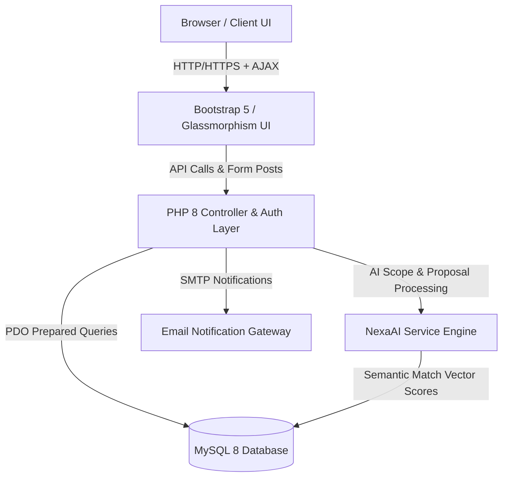
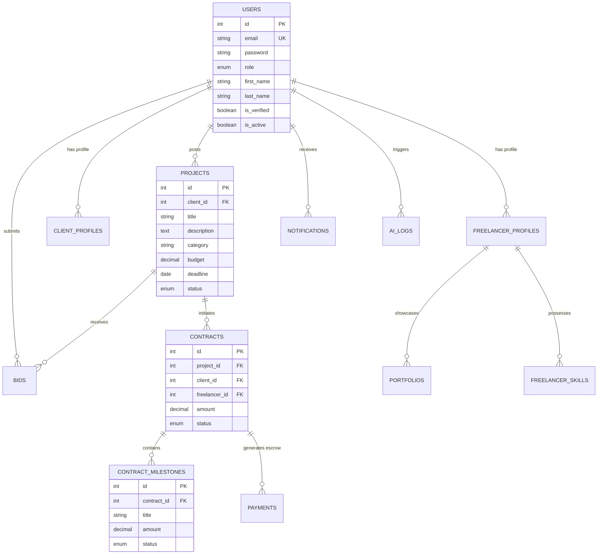
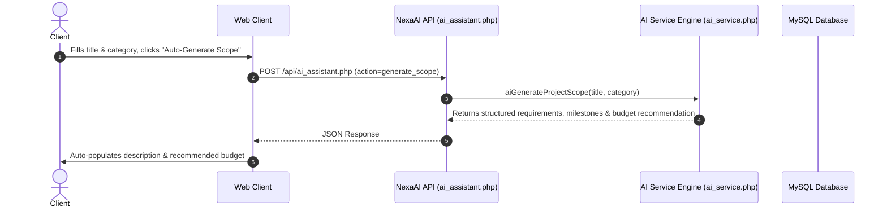

# NexaWork – AI-Powered Freelance Marketplace
## System Architecture & Technical Specifications Document

---

## 1. High-Level Architecture Overview

NexaWork is built on a modular, decoupled 3-tier enterprise architecture powered by Core PHP 8, MySQL 8, and an asynchronous JavaScript/AJAX AI integration layer.

---

## 2. Entity-Relationship (ER) Diagram

---

## 3. AI Service Pipeline & Sequence Diagram

---

## 4. Security Architecture & Controls

1. **Authentication & Session Security**:
   - Passwords hashed using `password_hash()` with BCrypt (cost factor 12).
   - Session identifiers regenerated (`session_regenerate_id(true)`) upon authentication to prevent session fixation.
   - Brute-force protection via `login_attempts` tracking.

2. **Cross-Site Request Forgery (CSRF)**:
   - Cryptographic CSRF tokens generated per session using `random_bytes(32)`.
   - Verified across all state-modifying `POST` requests via `verifyCsrfToken()`.

3. **File Upload Security**:
   - MIME type verification using server-side `finfo_file` (Fileinfo extension).
   - Extension blacklist prohibiting dangerous executables (`.php`, `.phar`, `.sh`, `.exe`, `.cgi`).
   - Obfuscated file renaming (`bin2hex(random_bytes(16))`).
   - Server-level execution prevention via `assets/uploads/.htaccess`.

4. **Database Security**:
   - 100% prepared statements via PDO with parameterized bindings to prevent SQL Injection.

---

## 5. API Endpoints Reference

| Endpoint | Method | Action Parameter | Description |
|----------|--------|------------------|-------------|
| `/api/ai_assistant.php` | `POST` | `generate_scope` | Generates project specifications & milestones |
| `/api/ai_assistant.php` | `POST` | `analyze_proposal` | Evaluates bid proposal text & budget fit |
| `/api/ai_assistant.php` | `POST` | `chat_assistant` | Conversational Marketplace Assistant |
| `/api/search.php` | `GET` | `q` | Autocomplete search for projects, freelancers, skills |
| `/api/activity.php` | `GET` | `limit` | Live marketplace activity ticker stream |
| `/api/notifications.php` | `POST` | `mark_read` | Updates notification read state |
